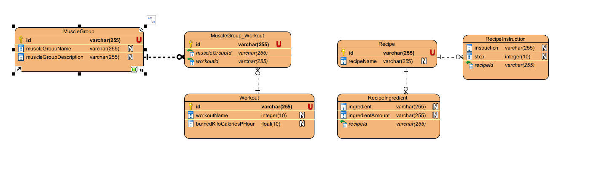

Swagger URL (dev): http://localhost:8081/swagger-ui/index.html#/

Swagger URL (prod): http://localhost:8080/swagger-ui/index.html#/

Online versie: https://fitness-api-boeev-emir-399322ec1a53.herokuapp.com/swagger-ui/index.html#/

Domeinmodellen:

De id's van alle domeinmodellen worden automatisch gegenereerd.

**MuscleGroup**

Houdt de naam en beschrijving van de spiergroep bij.
Het houdt ook de verschillende soorten oefeningen bij die op de respectievelijke spiergroep
gericht is.
Een spiergroep kan meerdere oefeningen bevatten en een oefening kan op meerdere spiergroepen gericht zijn.

**Recipe**

Houdt de naam, aantal kilocalorieën, instructies en ingrediënten van het recept bij.
Een recept kan meerdere instructies en ingrediënten bevatten en
worden in een lijst bijgehouden om kolommen met grote stukken tekst te vermijden.
De kilocalorieën kunnen nooit een negatieve waarde hebben, indien men dit probeert, wordt deze automatisch op 0 gezet.

**RecipeIngredient**

Houdt de naam en hoeveelheid van de ingredient bij.
De hoeveelheid wordt bijgehouden als String zodat men ook de eenheden van de hoeveelheid kan bijhouden.
Voorbeeld: 100g of asperges, 1/2 piece of chicken fillet.

**RecipeInstruction**

Houdt de naam en stap van de instructie bij.
Stap wordt bijgehouden om deze te sorteren in de front-end applicatie.

**Workout**

Houdt de naam, aantal verbrande kilocalorieën en de spiergroepen bij die deze oefening gericht is.
Het houdt de spiergroepen bij waarop de oefening gericht is.
Een spiergroep kan meerdere oefeningen bevatten en een oefening kan op meerdere spiergroepen gericht zijn.

